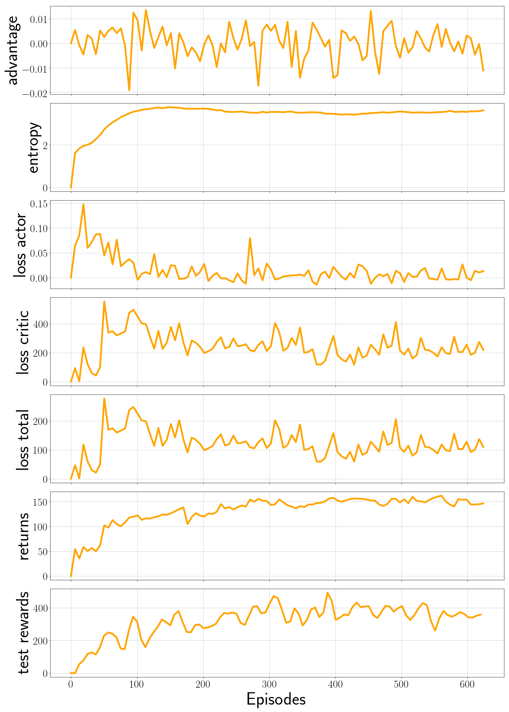

# walk-bot
PPO implementation of Humanoid-v2 from Open-AI gym
- Project completed as part of Prof. Capobianco's Deep Reinforcement Learning class
- Sapienza University of Rome

# Demo

# Installation
- Python 3.6.4
- Please see [requirements.txt](requirements.txt) for necessary modules

# Repo code structure
* [Report (PDF) detailing the implemenation and PPO](report/report.pdf)

* [PyTorch implementation](v_pytorch): taken from Move37 and altered to make project

* [Tensorflow implementation](v_tensorflow): my personal implementation of the above (P.S. very slow, to be improved)

# Sample Results:
* 
